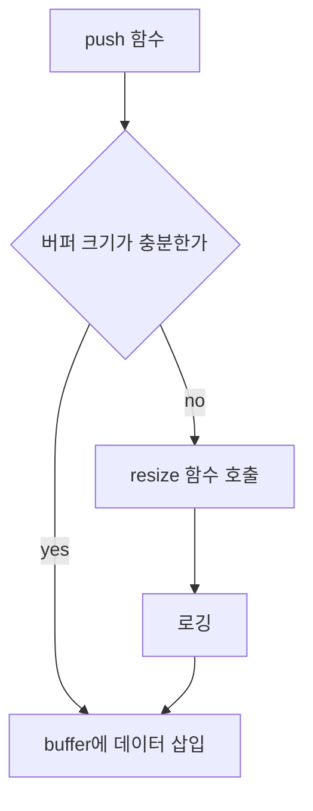

# ProtocolBuffer
네트워크 통신용으로 사용할 직렬화 버퍼이다.

## 기능
- 기본적인 버퍼의 push, pop
- 직접적인 버퍼 제어
- size, clear
- 버퍼 재할당

## 기본적인 버퍼의 push, pop
- push
  ```
  CProtocolBuffer buffer(10);
  buffer << 123;
  buffer.putData(3, "123");
  ```
  << 연산자를 사용하거나 함수를 사용해서 데이터를 삽입할 수 있습니다.<br>
  << 연산자에 대한 오버로딩이 기본적인 타입에 대해서만 되어 있습니다.<br>
  내부적으로 memcpy가 이루어지기 때문에 사용자 객체를 삽입하게 하는 것은 위험하다고 판단했습니다.<br>
  사용자가 정의한 객체에 대해서는 직접 구현해야 합니다.<br>
 - pop
   ```
   CProtocolBuffer buffer(10);
   int out;
   buffer >> out;

   char outBuf[3];
   buffer.popData(3, outBuf);
   ```
   push의 경우와 동일하게 >>연산자는 기본적인 타입에만 오버로딩 했습니다. <br>
  사용자가 정의한 객체에 대해서는 직접 구현해야 합니다.<br>
 
 ## 직접적인 버퍼 제어
- getBufStart
  > 버퍼의 시작 포인터를 반환합니다.
- getRearPtr
  > rear가 가르키는 버퍼의 포인터를 반환합니다.
 - getFrontPtr
   > front가 가르키는 버퍼의 포인터를 반환합니다.
 - moveRear
   > rear를 증가시킵니다.
 - moveFront
   > front를 증가시킵니다.
  ```
CProtocolBuffer buffer(10);
memcpy(buffer.getRearPtr(), "123", 3);
buffer.moveRear(3);
  ```

## size, clear
 - getUsedSize
  > 사용중인 버퍼 크기를 반환합니다.
 - getFreeSize
  > 남아있는 버퍼 크기를 반환합니다.
 - getRear
  > rear를 획득합니다.
 - getFront
  > front를 획득합니다.
 - clear
  > front, rear를 0으로 초기화합니다.
  > 버퍼에 대해서는 아무런 기능도 하지 않습니다.

## 재할당

재할당은 pushBuffer 함수 내부에서 자동으로 이루어집니다. <br>
push를 해야하는데 buffer가 모자라다면 buffer를 재할당하고 push 작업을 진행합니다.

